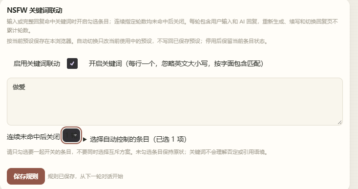
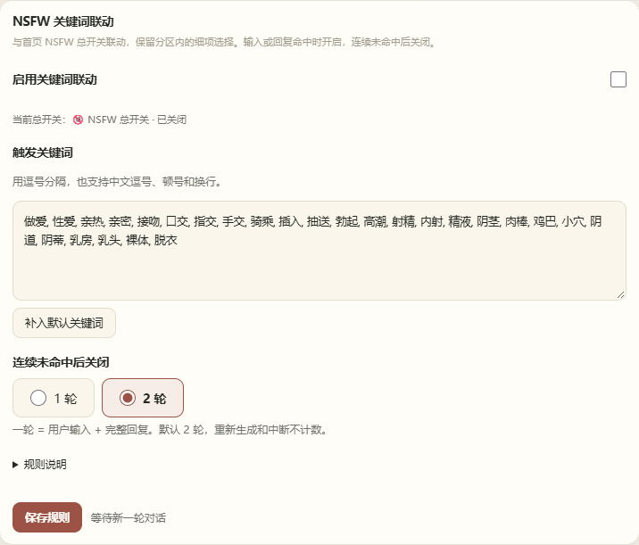
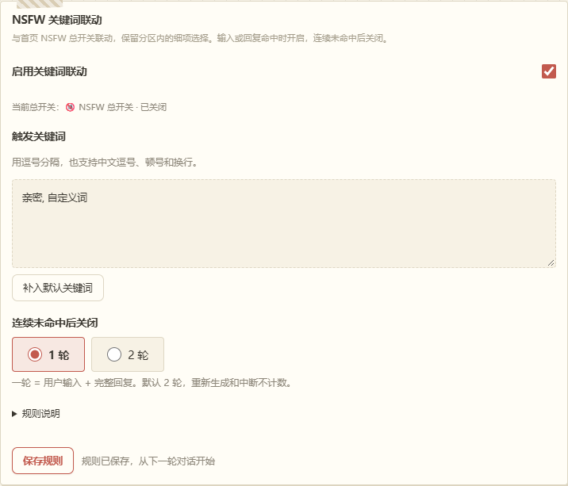
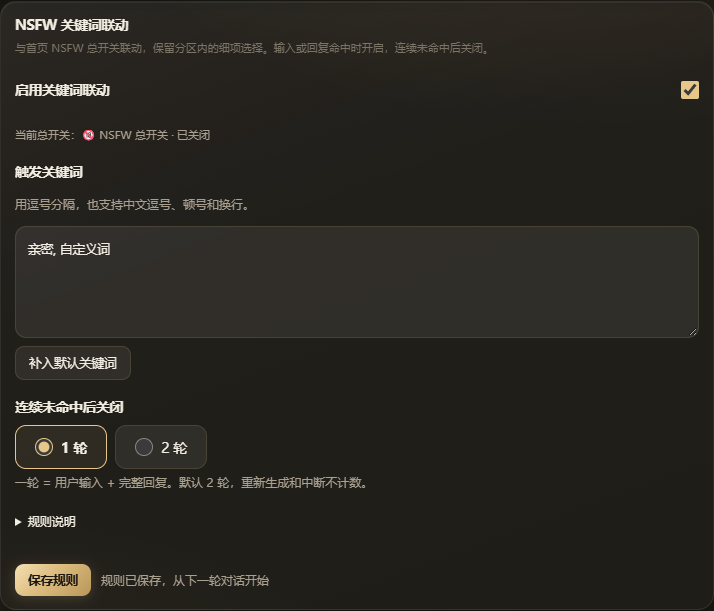
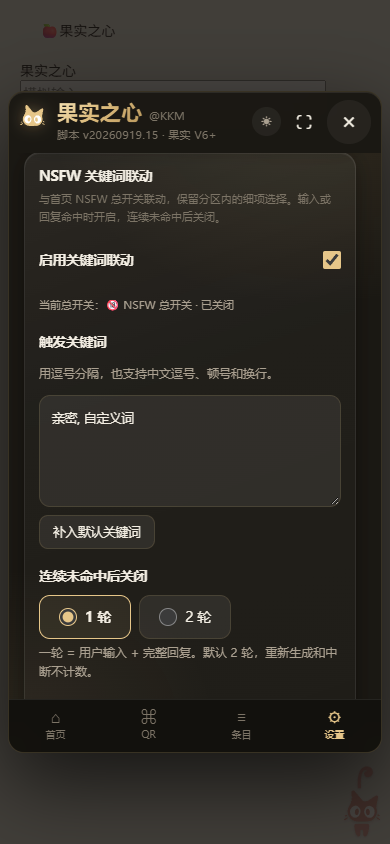

# 果实之心维护检查 · 2026-09-20

检查范围：关键词联动、现有 NSFW 总开关、设置交互与三皮肤、关闭/热重载/销毁、更新和缓存。基于当前源码、用户提供截图，以及加载完整构建脚本的本地模拟宿主。未接入真实酒馆账号、聊天、模型服务或独立 ECoT 脚本。

## 流程与截图证据

1. 用户原图：轮次下拉框文字与背景接近，标签和控件挤在同一行，条目选择重复了现有总开关的作用。
   
2. 修改后暖纸：改为“1 轮 / 2 轮”原生单选，带清晰标签、边框与焦点；移除条目选择，显示已识别总开关。词库支持逗号并可补入默认词。
   
3. 果园手账和黑金玻璃：使用原主题变量，选中状态同时通过单选点、边框和字重表达。截图中的“自定义词”用于验证编辑保存。
   
   
4. 手机宽度 390px：选项可读且未横向溢出；设置较长时在主内容区域纵向滚动，底部导航保留。
   
5. 操作验证：编辑关键词并切换首页/设置，草稿保留；保存后生效。文本框按 Tab 移到“补入默认关键词”。关闭面板只隐藏 UI，后台联动继续工作。
6. 生命周期验证：热重载前后均为 11 个模拟助手监听器、1 个面板、1 个猫咪入口；销毁后监听器为 0，面板、猫咪和全局入口移除，宿主快捷按钮文字、title 和 display 恢复。

## 已修复

| 问题 | 调整 |
|---|---|
| 关键词联动重复维护手选条目，容易与首页总开关不一致 | 复用 `nsfwMaster()` 定位同一条目；仅改总开关，细项保留 |
| 默认词库缺失、逐行编辑不便 | 内置 26 个去重关键词；支持逗号、中文逗号、顿号、分号、换行；旧自定义词合并保留 |
| 下拉选项在宿主主题下难以辨认 | 替换为有标签的原生 radio，使用现有主题变量与 44px 选项高度 |
| 设置自动刷新或导航可能丢失未保存输入 | 增加当前实例草稿与未保存提示，保护编辑中的设置 |
| 取消生成后排队的输入写入仍可能执行 | 取消时推进控制器世代，过期写入失效 |
| 面板焦点循环漏掉 textarea、summary 和链接 | 补入可聚焦控件；新字段都有可读标签 |
| 旧实例的按钮、预设和生成助手事件未显式解除 | 集中记录 stop 句柄；重新绑定前去重，销毁逐项解除并隔离清理异常 |
| 销毁后仍可能访问旧全局入口或渲染更新响应 | 移除所属全局入口、阻止旧 open、取消更新请求、抑制卸载后的渲染 |
| 快捷按钮的显示、文案和 title 未完整恢复 | 记录原值并在卸载时还原；清除断开节点的记录 |
| 猫咪轻微抖动即被当作拖拽 | 使用累计 4px 位移阈值，减少点击误判 |
| 合成快捷入口是 div，但缺少键盘激活 | 支持 Enter 与 Space |
| 异步预设操作完成时可能已换预设 | 更新前后核对身份及销毁状态；过期结果不继续保存具名预设 |
| 更新写缓存失败会丢失旧离线版本 | 面板和加载器都尝试恢复旧缓存，不再建议清空全部站点数据 |
| 本地测试版与上游版本标识/更新路径混淆 | 显示“本地测试”，关闭上游自动检查和下载，使用导入文件更新 |

## 验证结果与边界

- `node --test tests/*.test.mjs`：35 项通过，覆盖原模型映射、词法匹配、完整轮次冷却、配置迁移、总开关隔离、取消、重复写入、更新取消与缓存恢复。
- `node build.mjs --local` 与 `node --check dev/fruit-heart.js` 通过；发布目录、原安装文件和 release.json 未更改。
- 实际浏览器操作上述三种皮肤、390px 宽度、编辑/导航/保存、键盘移动、输入触发、关闭、热重载与销毁。整包输入触发后总开关为开启、细项仍为原状态。
- 这些结果不等于全部真实宿主兼容性或完整无障碍认证。真实流式回复结束时序、群聊、用户美化主题、移动浏览器触摸、模型连接与独立 ECoT 集成仍需在用户实际酒馆复测。

## 后续优化建议

- 优先补真实宿主回归：用一轮命中、两轮不命中验证关闭，再测试中断、换聊天、换预设和重新启用脚本。原生宿主版本与插件组合会影响事件时序。
- 通用预设写入可进一步统一排队：目前 UI、模型联动和生成流程仍有不同入口；本次加了过期检查，不是对宿主存储提供事务保证。
- 后续已完成设置、快捷入口、主题和生命周期等源码拆分，详见 [源码结构与维护入口](architecture.md)。拆分前后构建产物逐字节一致，测试增至 37 项；共享闭包的进一步隔离可另行推进。
- 规则目前按预设名称保存在本浏览器，改名或换设备不会自动迁移；若需要跨设备使用，可另加规则导入/导出。
- 关键词是字面包含，不理解否定、引用或语境；“亲密”“插入”等词可能误触发。词库按用户要求提供，可在设置中删除过宽的词。

关闭面板不是停用脚本。停用/卸载清理运行资源，但不自动回滚用户已经保存的预设、模型分组或独立 ECoT 设置，也不删除规则偏好；避免卸载意外覆盖用户后续修改。
